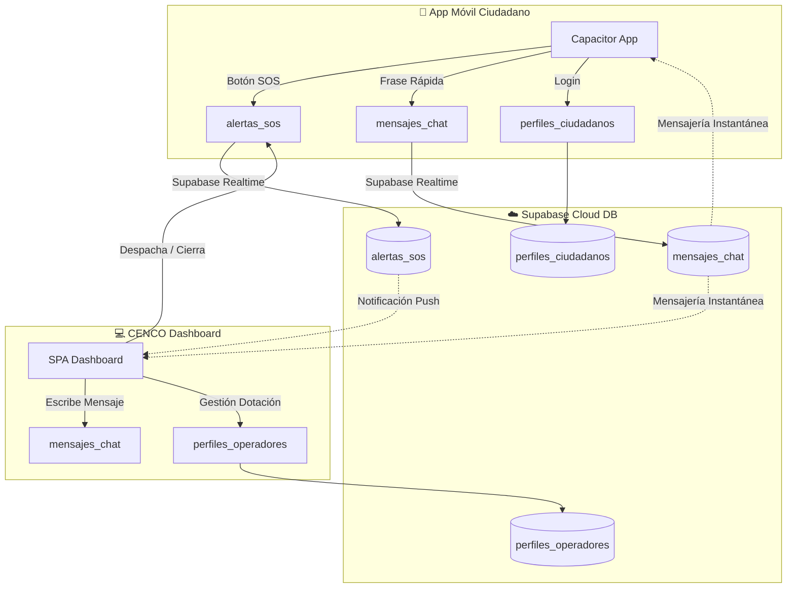

# Sistema CENCO Inclusivo 👮💬

Este repositorio contiene la suite de aplicaciones para el **Sistema de Emergencias CENCO Inclusivo de Carabineros de Chile**. El ecosistema está diseñado bajo la **Ley N° 21.719** y normativas de accesibilidad, permitiendo a personas sordas comunicarse de forma directa e instantánea con la central CENCO en situaciones de riesgo vital o denuncias.

El proyecto está sincronizado en tiempo real a través de **Supabase** y consta de dos módulos principales desarrollados con tecnologías web estándar:
1. 💻 **CENCO Dashboard:** Panel de control de operadores para el despacho de patrullas, administración de cuadrantes, control de perfiles y chat bidireccional en vivo.
2. 📱 **CENCO Móvil App:** Aplicación móvil híbrida para el ciudadano sordo con botón de pánico radial, chat en tiempo real por frases rápidas inclusivas y visualización del estado de su patrulla.

---

## 🛠️ Arquitectura del Sistema



---

## 🔑 Credenciales del Sistema (Acceso Rápido)

### 💻 CENCO Dashboard
* **Dirección:** [cenco-dashboard/index.html](file:///c:/Users/benja/Documents/weas%20de%20la%20u/Interfaces/app/cenco-dashboard/index.html)
* **Usuario (Operador):** `operator`
* **Contraseña:** `cenco2026`

### 📱 CENCO Móvil App
* **Dirección:** [cenco-movil-app/www/index.html](file:///c:/Users/benja/Documents/weas%20de%20la%20u/Interfaces/app/cenco-movil-app/www/index.html)
* **Usuario 1:** `juan.perez@email.com` / `password123`
* **Usuario 2:** `maria.gonzalez@email.com` / `password123`

---

## 💾 Migración de Base de Datos (Supabase)

Para inicializar la base de datos necesaria para el chat, operadores y cuadrantes, ejecuta la siguiente consulta en el **SQL Editor** de tu consola de Supabase:

```sql
-- 1. Tabla de perfiles ciudadanos (con credenciales de prueba)
create table public.perfiles_ciudadanos (
    rut text primary key,
    nombre_completo text not null,
    correo text not null unique,
    telefono text,
    contacto_nombre text,
    contacto_correo text,
    contacto_telefono text,
    es_bloqueado boolean default false,
    contrasena text default 'password123',
    creado_al timestamp with time zone default timezone('utc'::text, now()) not null
);

-- 2. Tabla de perfiles operadores y dotación policial
create table public.perfiles_operadores (
    id uuid default gen_random_uuid() primary key,
    nombre text not null,
    rango text not null,
    placa text not null unique,
    cuadrante text,
    creado_al timestamp with time zone default timezone('utc'::text, now()) not null
);

-- 3. Tabla de alertas SOS y llamadas de emergencia
create table public.alertas_sos (
    id uuid default gen_random_uuid() primary key,
    nombre_ciudadano text not null,
    rut_ciudadano text not null,
    ubicacion_texto text not null,
    latitud float8 not null,
    longitud float8 not null,
    estado text not null default 'PENDIENTE', -- 'PENDIENTE' | 'CRÍTICO' | 'EN ATENCION' | 'RESUELTO'
    categoria_tag text not null default 'SOS',
    patrulla_asignada text,
    creado_al timestamp with time zone default timezone('utc'::text, now()) not null
);

-- 4. Tabla de chat bidireccional en tiempo real
create table public.mensajes_chat (
    id bigint generated always as identity primary key,
    alerta_id uuid references public.alertas_sos(id) on delete cascade,
    rut_ciudadano text not null,
    remitente text not null, -- 'ciudadano' | 'central'
    mensaje text not null,
    creado_al timestamp with time zone default timezone('utc'::text, now()) not null
);

-- Deshabilitar RLS para desarrollo ágil y demostración sin tokens complejos
alter table public.perfiles_ciudadanos disable row level security;
alter table public.perfiles_operadores disable row level security;
alter table public.alertas_sos disable row level security;
alter table public.mensajes_chat disable row level security;

-- Habilitar replicación de Supabase Realtime para notificaciones y mensajería en vivo
alter publication supabase_realtime add table alertas_sos;
alter publication supabase_realtime add table mensajes_chat;
```

---

## ⚡ Instrucciones de Instalación y Ejecución

### 💻 Despliegue del Dashboard
1. Navega a la carpeta del dashboard:
   ```bash
   cd cenco-dashboard
   ```
2. Ejecuta un servidor local de desarrollo (por ejemplo con la extensión *Live Server* de VS Code, o utilizando python):
   ```bash
   python -m http.server 8080
   ```
3. Abre en tu navegador la dirección `http://localhost:8080` e ingresa con las credenciales de operador.

### 📱 Despliegue de la App Móvil
1. Navega a la carpeta del cliente móvil:
   ```bash
   cd cenco-movil-app
   ```
2. Instala las dependencias necesarias de Capacitor:
   ```bash
   npm install
   ```
3. Sincroniza la build web con la carpeta nativa de Android:
   ```bash
   npx cap sync android
   ```
4. Abre el emulador e instala el ejecutable nativo abriendo el proyecto en Android Studio:
   ```bash
   npx cap open android
   ```
5. En Android Studio, presiona **Run (Play)** en tu emulador o dispositivo físico conectado.
